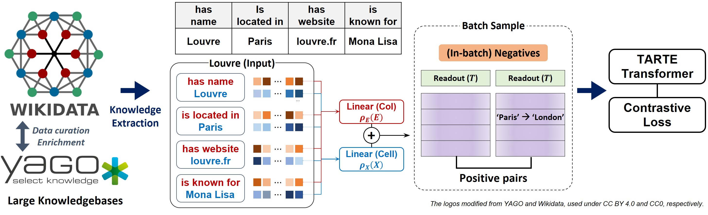

# TARTE: Transformer Augmented Representation of Table Entries



### NOTE: The repository is still in construction

This repository contains the implementation of **TARTE: Transformer Augmented Representation of Table Entries**.

TARTE is an easily-reusable pre-trained model that encodes data semantics across heterogeneous tables by pre-training from large knowledge bases. TARTE is a sibling work of [CARTE](https://github.com/soda-inria/carte), sharing many similarities, but with better pre-training and with more post-training paradigms.


> [!WARNING] <br>
> This library is currently in a phase of active development. All features are subject to change without prior notice. If you are interested in collaborating, please feel free to reach out by opening an issue or starting a discussion.


## Install

You can simply install TARTE from PyPI:

<pre>
pip install tarte-ai
</pre>

#### Post installation check
After a correct installation, you should be able to import the module without errors:

```python
import tarte_ai
```

## Examples

[Example](examples/example_tarte_post-training.ipynb) shows running three post-training strategies (presented in the paper) for TARTE:

## Pre-training and reproducing the results from the paper.

Details will soon be updated.

## TARTE-AI reference

```
@article{kim2025table,
  title={Table Foundation Models: on knowledge pre-training for tabular learning},
  author={Kim, Myung Jun and Lefebvre, F{\'e}lix and Brison, Ga{\"e}tan and Perez-Lebel, Alexandre and Varoquaux, Ga{\"e}l},
  journal={arXiv preprint arXiv:2505.14415},
  year={2025}
}
```


